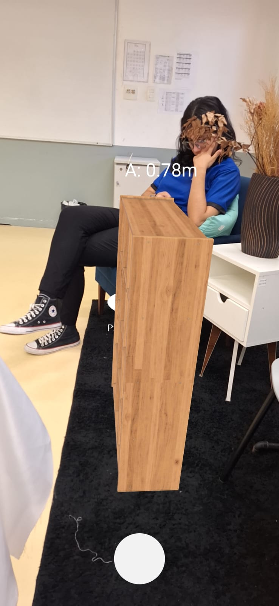
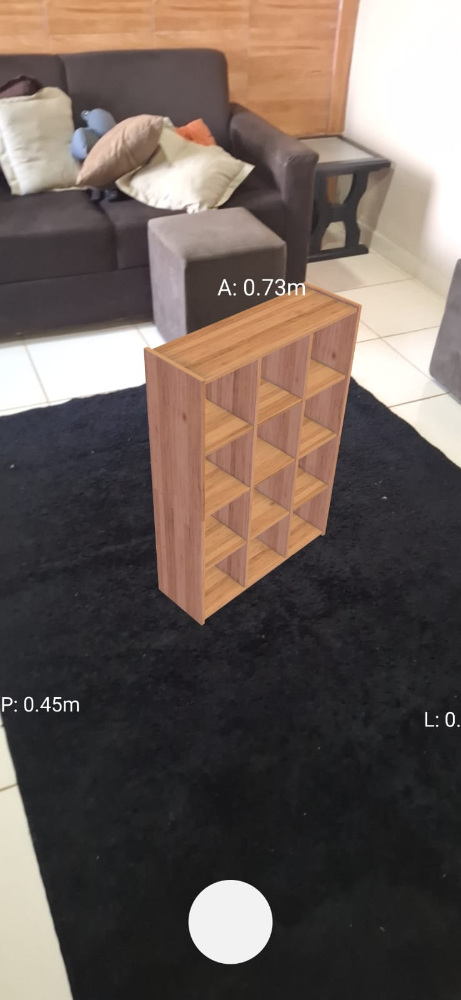

# Projeto Movita - Realidade Aumentada com WebXR


## Sobre
Este projeto faz parte do Movita, uma ferramenta que procura facilitar a venda de móveis planejados e o a realidade aumentada, implementada nesse repositório, utiliza WebXr para visualizar seu móvel planejado, assim, evitando possíveis transtornos e custos com refabricação.

## Tecnologias Utilizadas
- WebXR: Framework para desenvolvimento de experiências de Realidade Aumentada na web.
- Three js: utilizado para imprimir os modelos 3d na câmera do celular.
- npm: Gerenciador de pacotes JavaScript utilizado para instalação de dependências e scripts de inicialização.

## Instalação
1. Clone o repositório e acesse a pasta
   ````bash
   git clone https://github.com/AlexandreJr16/movita-ar.git
   cd movita-ar
   ````
2. Instale as dependências
   ````
   npm install
   ````
3. Inicie o projeto
   ````
   npm run dev
   ````
#### Observação

Para utilizar em outros dispositivos, é necessário que a conexão seja segura (HTTPS). Para testar localmente ou compartilhar temporariamente o acesso via internet, você pode utilizar ferramentas como Ngrok ou Cloudflare.


## Imagens
<p float="left">
  
  
</p>
